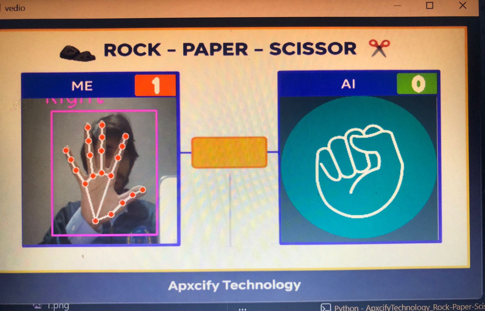
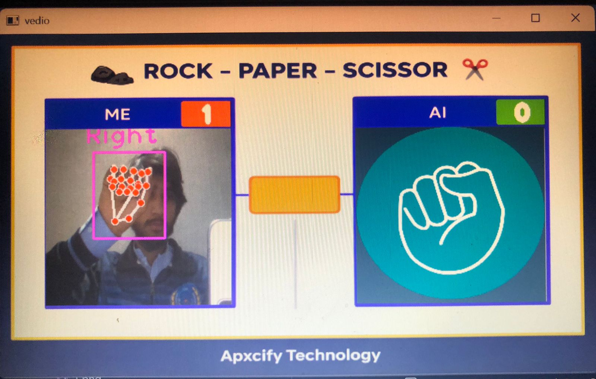
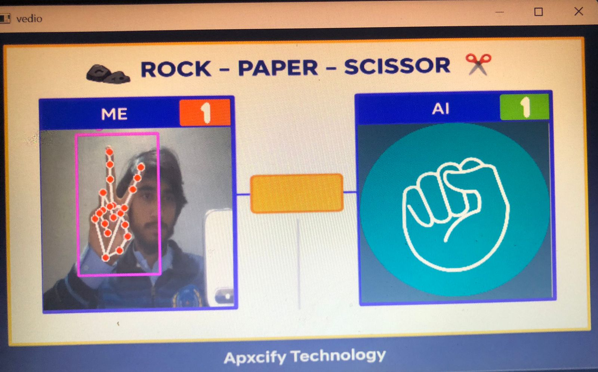
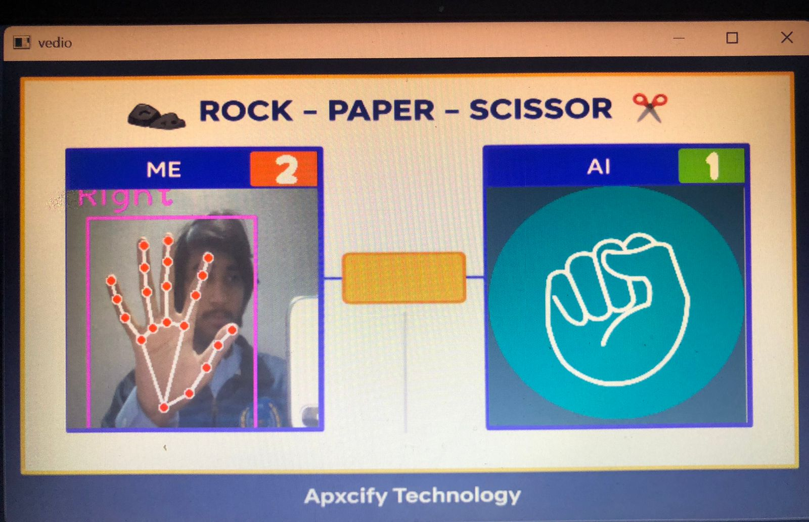
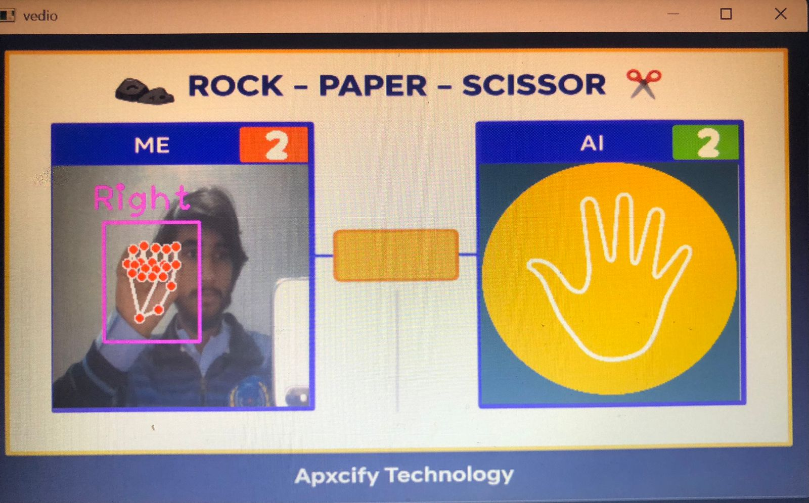
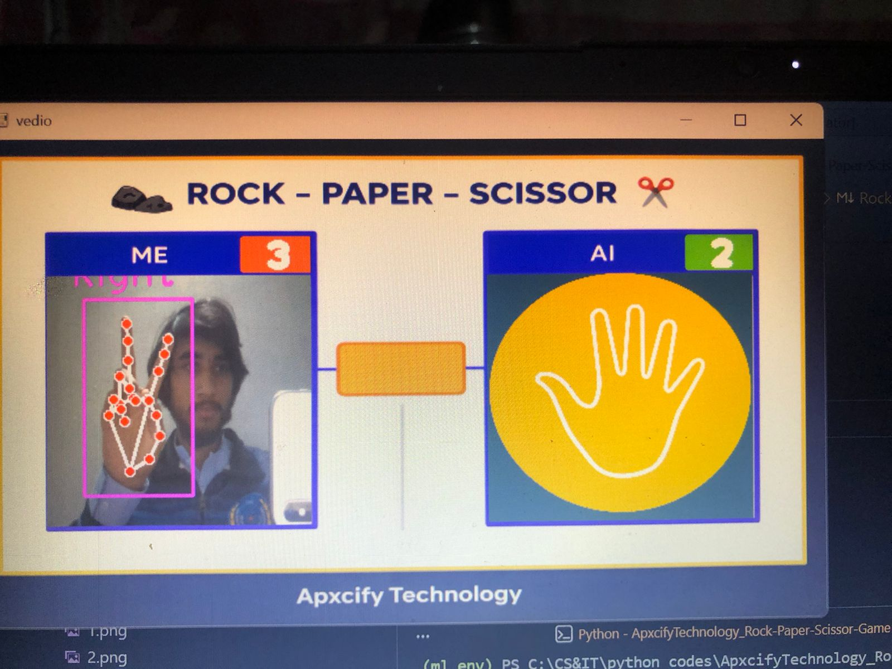

# ApxifyTechnology-Rock-Paper-Scissor-Game

Welcome to **ApxifyTechnology-Rock-Paper-Scissor-Game**, a computer vision-based implementation of the classic Rock-Paper-Scissors game. This project uses OpenCV and CvZone's Hand Tracking Module to recognize hand gestures, enabling players to compete against an AI in real time.

---

## ScreenShots
<div style="display: flex; justify-content: space-between;">
  
  
  
</div>

<div style="display: flex; justify-content: space-between;">
  
  
  
</div> 

---

## Features
- **Real-time hand tracking**: Detects gestures using your webcam.
- **AI opponent**: AI makes random moves for competitive gameplay.
- **Interactive UI**: Displays live scores.
-
 **Hand gestures supported**:
  - **Rock**: All fingers folded.
  - **Paper**: All fingers open.
  - **Scissors**: Only index and middle fingers open.

---

## How It Works
1. **Hand Tracking**:
   - Uses `cvzone.HandTrackingModule` for detecting and interpreting hand gestures.
2. **Gameplay**:
   - Recognizes the player's gesture.
   - Generates a random AI move.
   - Compares gestures to determine the winner based on traditional rules:
     - Rock beats Scissors.
     - Scissors beats Paper.
     - Paper beats Rock.
3. **Scoring**:
   - Updates and displays the score for both player and AI in real time.
   - Visual feedback enhances the game experience.

---

## Installation and Setup
### Requirements
- **Python 3.8 or higher**
- **Libraries** (install via `pip`):
  ```bash
  pip install opencv-python cvzone
  ```

### Steps
#### Clone This Repository
```
  git clone https://github.com/asimtaseer/ApxcifyTechnology_Rock-Paper-Scissor-Game.git
  cd ApxcifyTechnology_Rock-Paper-Scissor-Game
```
#### Run File Using
```code.ipynb```

---

# Controls
- **Start:** Press `S` to start the game.
- **Quit:** Press `Q` to exit the game.

---

## Video Demo
Check out the gameplay video on YouTube:
(pending)

---

# Author
**Asim Taseer Qureshi**  
[GitHub](https://github.com/asimtaseer) | [LinkedIn](https://www.linkedin.com/in/asimtaseer/)

---

Enjoy the game!  🎮
